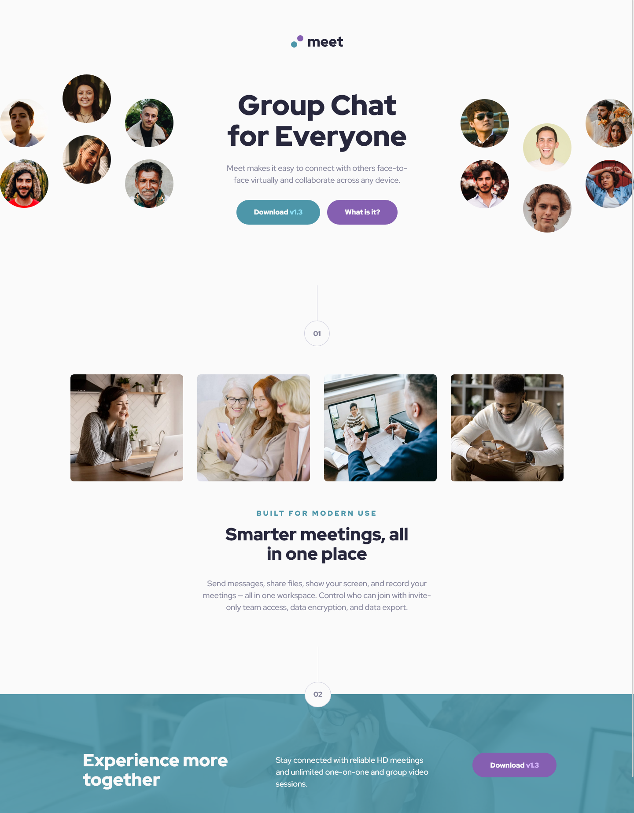

# Frontend Mentor - Meet landing page solution

This is a solution to the [Meet landing page challenge on Frontend Mentor](https://www.frontendmentor.io/challenges/meet-landing-page-rbTDS6OUR).

## Table of contents

- [Overview](#overview)
  - [The challenge](#the-challenge)
  - [Screenshot](#screenshot)
  - [Links](#links)
- [My process](#my-process)
  - [Built with](#built-with)
  - [What I learned](#what-i-learned)
  - [Continued development](#continued-development)
- [Author](#author)

## Overview

### The challenge

Users should be able to:

- View the optimal layout depending on their device's screen size
- See hover states for interactive elements

### Screenshot



### Links

- Solution URL: [GitHub](https://github.com/g-akca/meet-landing-page)
- Live Site URL: [Add live site URL here](https://g-akca.github.io/meet-landing-page/)

## My process

### Built with

- Semantic HTML5 markup
- CSS custom properties
- Flexbox
- CSS Grid
- Mobile-first workflow
- Media queries

### What I learned

I learned how to set background image with a transparent color on it, while fitting the image in the container without repeating.

```css
#download-section {
    background: linear-gradient(rgba(77, 150, 168, 0.9), rgba(77, 150, 168, 0.9)), url(./assets/mobile/image-footer.jpg);
    background-size: cover;
    background-position: center;
    background-repeat: no-repeat;
    ...
}
```

Also, I like how I set up the little hanging section numbers.

```css
.section-num {
    display: flex;
    flex-direction: column;
    align-items: center;
}

.section-num .num-hanger {
    width: 1px;
    height: 80px;
    background-color: var(--slate-300);
}

.section-num span {
    padding: 16px 19px;
    border: 1px solid var(--slate-300);
    border-radius: 50%;
    color: var(--slate-600);
    font-weight: 900;
    line-height: 150%;
    background-color: var(--white);
}
```

### Continued development

I want to keep my styles more organized, and make paddings etc. more responsive.

## Author

- GitHub - [@g-akca](https://github.com/g-akca)
- Frontend Mentor - [@g-akca](https://www.frontendmentor.io/profile/g-akca)
